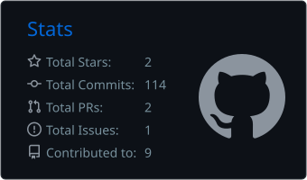
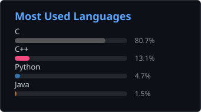
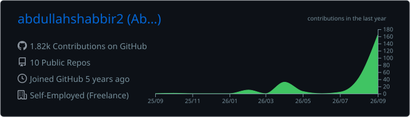

<h1>Hi, I'm Abdullah Shabbir 👋</h1>

  <strong>3+ years taking connected-device products from schematic and PCB layout through firmware, security, cloud integration, and field deployment.</strong>

  
  
  
  
  
  

  
  
  

---

## 💼 About Me

- 🔧 **Embedded Systems & IoT Engineer** who owns the whole product: requirements, architecture, hardware, firmware, cloud, and field deployment
- 🧩 Hands-on across many boards: **Nordic nRF5340 & nRF52840 (and their DKs)**, ESP32, STM32, TI CC13xx, Raspberry Pi, and my own custom PCBs
- ⏱️ Real-time firmware on **FreeRTOS and Zephyr** with **sub-10 ms task jitter** and **sub-5 ms** battery-switching latency
- 🐧 Builds **Embedded Linux** gateways with **Yocto**: read-only rootfs, A/B updates, systemd-supervised daemons
- 🚘 Working in **automotive software**: AUTOSAR Classic, CAN/ISO 11898, ISO-TP, UDS, MISRA C/C++, ISO 26262
- 🎓 Completing an **M.Sc. in Internet & Multimedia Engineering** at the University of Genoa, Italy
- 💬 Open to **embedded / IoT / automotive firmware** roles across the EU

---

## ⚡ At a Glance

<table>
<tr>
<td width="50%" valign="top">

**🔌 Boards, MCUs & dev kits I've built on**

| Family | Chips & boards |
| --- | --- |
| Nordic | **nRF5340** (dual-core, Zephyr), **nRF52840**, nRF5340 DK, nRF52840 DK |
| Espressif | ESP32, ESP8266 |
| ST | STM32 F1, STM32 F4 |
| TI Sub-GHz | CC1312, CC1352P7 |
| Linux / SBC | Raspberry Pi, qemuarm64 (Yocto) |
| FPGA | Altera DE2 (Intel Quartus) |
| Core | ARM Cortex-M (bare metal & HAL) |

</td>
<td width="50%" valign="top">

**🧵 Systems & radios**

| Area | What I use |
| --- | --- |
| RTOS / OS | FreeRTOS, Zephyr, Embedded Linux, Yocto |
| Short range | BLE 5.0, Wi-Fi, NFC (PN7160), UWB (DW3110) |
| Wired / field | CAN/CANopen, RS485/Modbus, Ethernet, OPC-UA |
| On-board | UART, I2C, SPI, JTAG/SWD |
| Cloud | AWS IoT Core, Azure IoT Hub, ThingsBoard, OpenRemote |
| Quality | Host unit tests, GitHub Actions CI, MISRA, cppcheck |

</td>
</tr>
</table>

---

## 🔐 Device & MQTT Security

Security is designed in from the first board revision, not bolted on at release.

| Layer | What I implement |
| --- | --- |
| 🔑 **Transport** | MQTT over **mutual TLS** with per-device **X.509 client certificates** and **server certificate pinning** on AWS IoT Core and Azure IoT Hub |
| 🧾 **Authorisation** | **Per-device topic permissions**: each device may publish and subscribe only on its own topics, enforced by broker policies tied to its certificate identity |
| 📨 **Messaging** | Structured **MQTT topic architectures** and **device-shadow synchronisation** across AWS IoT, Azure IoT Hub, ThingsBoard, and OpenRemote |
| 📦 **Updates** | **Signed OTA pipelines**; A/B image-swap updates on Embedded Linux gateways |
| 📐 **Practice** | **IEC 62443** principles, CE/RED design guidance, credential-hygiene checks in CI |

---

## 🧠 Expertise

| Area | Skills |
| --- | --- |
| 📦 **Embedded Firmware** | C, C++, ESP-IDF, FreeRTOS, Zephyr OS, bare-metal C, HAL, device drivers, bootloaders |
| 🐧 **Embedded Linux** | Yocto Project, custom layers, read-only rootfs, A/B image updates, systemd services and watchdog, QEMU |
| 📶 **Wireless & Protocols** | BLE 5.0, Wi-Fi, MQTT, HTTP/REST, GSM/LTE, LTE-M, LoRa, UWB, 868 MHz, NFC, CAN/CANopen, RS485/Modbus, OPC-UA |
| ☁️ **Cloud & Apps** | Python, FastAPI, Flask, AWS IoT Core, AWS Lambda, Azure IoT Hub, ThingsBoard, OpenRemote, Home Assistant, Flutter BLE apps, Docker |
| 🔬 **FPGA & HDL** | VHDL, Intel Quartus, RTL simulation, finite state machine design, RISC datapath |
| 🛠️ **Debug & Tools** | Oscilloscope, logic analyser, JTAG/SWD, OpenOCD, LTspice, Keil MDK, STM32CubeIDE, Zephyr west, CMake, PlatformIO |
| 🚘 **Automotive & Standards** | AUTOSAR Classic, ISO 11898, ISO-TP, UDS, MISRA C, MISRA C++ / AUTOSAR C++14, ISO 26262, binary analysis, fault injection |

---

## 🚀 Tech Stack

**Hardware & Firmware**

**Embedded Linux & FPGA**

**Languages**

**Connectivity & Cloud**

**Security**

**Automotive, Standards & Binary Analysis**

---

## 💼 Experience

| Role | Company | Period |
| --- | --- | --- |
| 🧑‍💻 **Freelance IoT & Embedded Systems Engineer** | Self-employed · Remote | Jul 2024 – Present |
| ⚡ **Embedded Systems Engineer** (contract) | LUMS Energy Institute, Pakistan | Oct 2024 – Nov 2024 |
| 📡 **IoT Engineer** | Digitalux, Pakistan | Jul 2023 – Nov 2024 |
| 🔧 **Embedded Systems Intern** | KICS, UET, Pakistan | Jul 2022 – Sep 2022 |
| 🏭 **Engineering Intern** | Pak Elektron Limited (PEL), Pakistan | Aug 2021 – Sep 2021 |

<strong>Highlights</strong>

- **LUMS Energy Institute:** ESP-IDF firmware for an EV battery monitoring and control unit (CAN telemetry, GPS, fail-safe switching) and a PZEM-004T RS485/Modbus smart energy meter, both with GSM/MQTT uplink to AWS
- **Digitalux:** ESP32/ESP8266 firmware for commercial products shipped to customers, MQTT topic design, device shadows, and OTA on AWS IoT, Azure IoT Hub, ThingsBoard, and OpenRemote; introduced a DFM checklist that cut board re-spins
- **KICS, UET:** UART, I2C, and SPI drivers and HAL work on ARM Cortex-M, sensor-node pipelines to AWS IoT Core

---

## 📂 Projects

### ⭐ Featured

#### 🚘 [AUTOSAR EV Telematics & Odometry ECU](https://github.com/abdullahshabbir2/autosar-ev-telematics)

Production-grade **AUTOSAR Classic** layered firmware for an electric-vehicle telematics and odometry ECU, rebuilt from a shipped v1 that lost odometer data in the field. Five layers — MCAL, ECU abstraction, services, RTE, application — with every hardware-touching module split into a host-testable pure core and a target-only platform leaf. Roughly **90% of the source runs under the host suite**, and the split is enforced mechanically: the test runner links every source file into every test binary, so a platform dependency leaking above the MCAL is a link error rather than a review comment.

Integer-only odometry with a Q32 conversion factor and carried remainder, because `float` cannot represent every millimetre past 16.8 km. Crash-safe flash persistence where a record becomes authoritative on a single byte write. ISO 14229 diagnostic event management with debouncing, freeze frames and healing. Per-task watchdog supervision with execution budgets asserted at compile time.

**335 host unit tests** across 16 suites · **six CI gates** (tests under 11 warning flags, firmware build, cppcheck, clang-format, Doxygen warnings-as-errors, credential hygiene) · 129 documented requirements with generated traceability · six architecture decision records · eight hand-written SVG diagrams.

Writing the tests found four defects in code that had already been reviewed: a silent NvM write loss, a poisoned flash slot no retry could clear, a backlog that never crossed a date boundary, and a cellular fallback that was permanent for the life of the run.

`AUTOSAR Classic` `Embedded C` `ESP32` `FreeRTOS` `CAN` `RS485/Modbus` `ISO 14229 UDS` `Unit Testing` `GitHub Actions` `Doxygen`

### 🚙 Automotive Diagnostics & Binary Analysis

#### 🧪 [ECU Programming Workbench](https://github.com/abdullahshabbir2/ecu-programming-workbench)

Python diagnostic-programming laboratory with a virtual ECU, classical CAN/ISO-TP transport, a UDS service subset, session handling, block transfers, integrity verification, and A/B image activation. Includes lost-acknowledgement recovery, voltage/RPM interlocks, interrupted-update tests, and recorded CAN/UDS traces. **36 automated tests** cover the host simulation; physical ECU flashing is outside its validated scope.

`Python` `CAN` `ISO-TP` `UDS` `A/B Update Model` `CRC32` `SHA-256` `Fault Injection`

#### 🧬 [Strategy Patch Lab](https://github.com/abdullahshabbir2/strategy-patch-lab)

C++17 strategy model and owned-binary modification workflow for a Windows x86-64 host executable. Extracts calibration tables, applies a hash-checked instruction patch, corrects the PE checksum, compares baseline/patched behavior, and restores the exact original binary. Models map switching, ethanol fuel compensation, launch and shift torque limits with protection checks. Includes disassembly, address maps, **11 patch tests**, and a **421-step replay**. Validation uses an owned x86-64 image and synthetic inputs.

`C++17` `Python` `Binary Analysis` `PE32+` `GNU objdump / nm` `Checksum Verification` `Regression Testing`

### 📡 IoT & Embedded Products

#### 🚗 EV Battery Monitoring & Control System

CAN telemetry to **ISO 11898 at 500 kbps** for cell and vehicle data, with FreeRTOS priority-partitioned tasks holding battery switching logic at **sub-5 ms latency**. Control firmware written to **MISRA C++ / AUTOSAR C++14** guidelines: no runtime allocation, bounded loops, deterministic state transitions. GPS tracking, RS485/Modbus metering, and GSM/MQTT cloud uplink, validated on vehicle hardware.

`STM32` `ESP32` `C++` `FreeRTOS` `CAN / ISO 11898` `RS485/Modbus` `GSM` `MQTT` `MISRA C++`

#### 📻 Sub-GHz Sensor Network & Gateway

Shared **868 MHz** network where coin-cell sensor nodes report to a common hub that relays to the cloud, reusing one radio infrastructure across product lines. Selected CC1312 and dual-band CC1352P7 against size, power, and cost.

`TI CC1312` `CC1352P7` `868 MHz` `Coin Cell` `Gateway`

#### 🌬️ [Smart Air Purifier & Air Quality Monitor](https://github.com/abdullahshabbir2/AirPurifier)

ESP32 purifier firmware that computes a US EPA Air Quality Index on-device from particulate, CO, NO2, temperature, and humidity sensors, then drives the fan to match through hysteresis-damped PWM speed control. Publishes telemetry over both a versioned REST API and a NimBLE GATT service with notifications, provisions WiFi from a phone over BLE, and ships a dependency-free AQI engine covered by 120 host unit tests in CI.

`ESP32` `ESP-IDF` `FreeRTOS` `BLE 5.0` `NimBLE` `REST API` `LEDC PWM` `Unit Testing` `GitHub Actions` `C`

#### 🌱 [Smart IoT Greenhouse System](https://github.com/abdullahshabbir2/Smart_IoT_GreenHouse)

Dual-node ESP32 greenhouse automation system with independent local dashboards, REST APIs, mDNS discovery, NVS persistence, watchdog recovery, CORS support, fan hysteresis, pump scheduling, low-water lockout, and rain-based irrigation protection.

`ESP32` `C++` `PlatformIO` `REST API` `mDNS` `NVS` `Watchdog` `IoT Dashboard`

#### 💧 Hydroponic Monitoring System

STM32 hydroponic monitoring with high-precision water chemistry and environmental sensing, including analog front-end conditioning and calibration where sensor drift directly affects crop outcomes.

`STM32` `Analog Front End` `Sensor Calibration`

#### 🚰 [Smart Cistern & Irrigation Controller](https://github.com/abdullahshabbir2/home-assistant-cistern-integration)

Custom Home Assistant integration plus ESP32 firmware for cistern monitoring, relay control, irrigation scheduling, telemetry polling, Zeroconf discovery, coordinator-based updates, and Lovelace dashboard entities.

`ESP32` `Python` `Home Assistant` `Arduino` `REST/JSON` `Lovelace` `Automation`

#### 🔌 [ESP32 + Quectel M95 - MQTT over GSM](https://github.com/abdullahshabbir2/quectelm95_gsm_mqtt)

Bare-metal ESP32 firmware that drives a Quectel M95 GSM modem directly through AT commands. It handles PDP context activation, TCP transport setup, MQTT CONNECT/PUBLISH flow, response validation, and the two-step `QMTPUB` payload prompt sequence.

`ESP32` `C++` `AT Commands` `MQTT` `GSM/GPRS` `UART` `PlatformIO`

### 🐧 Embedded Linux

#### 🧱 meta-iot-gateway — Yocto Linux Layer

Custom Yocto image booted on **qemuarm64** with a read-only rootfs, writable state overlay, **A/B image-swap updates**, and no package manager on target. A C daemon validates **CRC-16/CCITT** UART frames and republishes them to MQTT, with systemd watchdog integration and exponential reconnect backoff.

`Yocto` `Embedded Linux` `systemd` `QEMU` `C` `MQTT` `A/B Updates`

### 🎓 Academic & Other

#### 🧠 Parkinson's Monitoring System

`nRF52` `BLE 5.0` `Raspberry Pi` `Python` `IMU` `Edge ML`

#### 🔲 Digital Design on FPGA

Basic **RISC processor in VHDL** (fetch, decode, execute datapath with register file and control unit) verified in simulation and on the DE2 board, plus FSM controllers for a vending machine and home automation system.

`VHDL` `Intel Quartus` `Altera DE2` `RTL Simulation` `FSM`

#### 🛒 [Grocery Warehouse Inventory System](https://github.com/abdullahshabbir2/Grocery-WareHouse)

Java Swing desktop inventory system with MySQL-backed create, read, update, and delete flows for grocery items, plus a Jupyter Notebook component for data-oriented work in the same repository.

`Java` `Swing` `MySQL` `JDBC` `CRUD` `Jupyter Notebook`

---

## 🖨️ PCB Design Highlights

- 📦 **8+ custom PCBs** in KiCad and EasyEDA, with multi-voltage 3V/5V/12V power architectures and hardware-selectable power paths
- 📶 NFC and multi-radio layouts with RF keep-out zones, impedance-aware routing, and ground stitching
- 🛰️ Sub-30 g GPS + LoRa + UWB + GSM tracker PCB
- ⚡ 12V DC-to-AC inverter with MOSFET H-bridge, dead-time generation, TVS protection, and fusing
- 🔬 Power-supply and analog signal-path verification in LTspice; DFM checklist that reduced re-spins

---

## 🎓 Education & Certifications

| | | |
| --- | --- | --- |
| 🎓 **M.Sc. Internet & Multimedia Engineering** | University of Genoa, Italy | 2024 – 2026 (expected) |
| 🎓 **B.Sc. Computer Engineering**, graduated with Distinction | COMSATS University Islamabad, Pakistan | 2019 – 2023 |
| 📜 **ISO 26262: Essentials of Automotive Functional Safety** | Alison (CPD certified) | Sep 2026 |
| 📜 **Registered Computer Engineer** | Pakistan Engineering Council | Jan 2024 |

🗣️ **Languages:** English (C1, professional) · Urdu (native) · Italian (A1, working toward B2)

---

## 🔥 GitHub Stats

---

## 📫 Contact

Always happy to talk embedded systems, IoT security, and automotive firmware.

